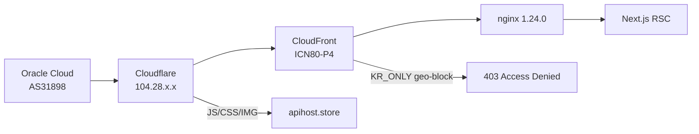

# toki31.com (뉴토끼) 재분석 보고서

> **분석일**: 2026-09-06
> **이전 문서**: [02-BOT-BYPASS.md](02-BOT-BYPASS.md)의 toki31 섹션은 **현재와 다른 보안 구조**를 기준으로 작성됨
> **핵심**: toki31이 CloudFront → Cloudflare + Next.js RSC로 전환, bookto31과 별도 아키텍처

## 1. 요약

| 항목 | 내용 |
|------|------|
| 분석 대상 | `toki31.com` (뉴토끼) |
| 이전 보안 | CloudFront ASN 차단 + KR_ONLY 국가 검증 |
| **현재 보안** | **CloudFront geo-block (edge)** + **Cloudflare WAF** + **Next.js RSC** |
| bookto31과 차이 | bookto31: Cloudflare Turnstile + GNUBOARD5 / toki31: CloudFront + Cloudflare + Next.js |
| 우회 난이도 | **상** (geo-block이 근본 문제) |
| 부분 우회 가능 | `/`(홈), `/ing`(연재중), `/end`(완결), `/rank` — **curl_cffi chrome131 직통 OK** |

## 2. 현재 보안 아키텍처



### 2.1 감지된 보안 헤더

```http
HTTP/1.1 403 Forbidden
server: nginx/1.24.0 (Ubuntu)
x-cache: Error from cloudfront
x-amz-cf-pop: ICN80-P4          # 서울 edge
x-block-code: KR_ONLY
x-block-reason: "Country restriction: only KR is allowed, detected country is CZ."
x-client-ip: 104.28.239.59      # Cloudflare edge IP (우리 Oracle IP 아님)
x-client-country: CZ
```

**중요**: `x-client-ip`가 Oracle IP가 아닌 Cloudflare IP(104.28.x.x)로 표시됨
→ Cloudflare가 CloudFront에 요청을 전달하면서 Cloudflare의 egress IP가 CZ로 오분류됨
→ 이는 **TLS fingerprint 문제가 아님** (curl_cffi로 해결 불가)

### 2.2 프레임워크 전환

| 구분 | 이전 | 현재 |
|------|------|------|
| 프레임워크 | GNUBOARD5 + APMS | Next.js (React Server Components) |
| CDN | CloudFront | CloudFront + Cloudflare |
| 정적 에셋 | 자체 서빙 | `apihost.store` (별도 도메인) |
| JS 프레임워크 | jQuery | Next.js 14+ (RSC) |
| 데이터 전달 | SSR HTML | RSC payload (inline script) |

## 3. 엔드포인트 접근성

### 3.1 접속 가능 (curl_cffi chrome131, 프록시 불필요)

| 경로 | 설명 | 상태 | 크기 | 비고 |
|------|------|------|------|------|
| `/` | 홈 | 200 | 267KB | 뉴토끼 메인 콘텐츠 정상 |
| `/ing` | 연재중 웹툰 | 200 | 212KB | **RSC payload에 회차 데이터 포함** |
| `/end` | 완결 웹툰 | 200 | 217KB | 정상 |
| `/rank` | 랭킹 | 200 | 200KB | 정상 |

### 3.2 차단됨 (전부 403)

| 경로 | 설명 | 차단 사유 |
|------|------|----------|
| `/novel` | 소설 목록 | CloudFront KR_ONLY |
| `/novel/{id}` | 소설 상세 | CloudFront KR_ONLY |
| `/novel/{id}/{ep}` | 회차 본문 | CloudFront KR_ONLY |
| `/search` | 검색 | CloudFront KR_ONLY |
| `/event` | 이벤트 | CloudFront KR_ONLY |

### 3.3 /ing 페이지 RSC payload 데이터

`/ing` 페이지의 inline script에 Next.js RSC(React Server Components) payload가 포함되어 있으며, 여기서 구조화된 데이터를 추출할 수 있음:

```json
{
  "episodeCount": null,
  "isUpdatedToday": false,
  "latestEpisodeNumber": 18,
  "viewsWeek": 0,
  "platformId": 1,
  "rating": 3,
  "ageRating": 15,
  "updatedAt": "2026-09-05",
  "hasUpdate": false,
  "isFavorite": false
}
```

**추출 가능한 필드**: `episodeCount`, `latestEpisodeNumber`, `viewsWeek`, `platformId`, `rating`, `ageRating`, `updatedAt`, `hasUpdate`, `isFavorite`, `isFavorited`

## 4. bookto31과의 분리 사항

### 4.1 아키텍처 차이

| 항목 | bookto31 (북토끼) | toki31 (뉴토끼) |
|------|------------------|-----------------|
| 우회 방식 | FlareSolverr (헤드리스 브라우저) | curl_cffi + KR proxy (또는 geo-block 우회 필요) |
| 보안 | Cloudflare Turnstile | CloudFront KR_ONLY + Cloudflare |
| 프레임워크 | GNUBOARD5 + APMS | Next.js RSC |
| CDN | Cloudflare | CloudFront + Cloudflare |
| rate limit | 8분 + ±2분 jitter | 미정의 (현재 접속 불가) |
| 구현 파일 | `services/bookto31.py` | `services/toki31.py` |

### 4.2 코드 분리 상태

- `services/toki31.py` — **curl_cffi 미사용** (현재는 Python requests + 무료 KR proxy)
- `services/bookto31.py` — FlareSolverr 기반, 정상 운영 중
- `ebook_worker.py` — **bookto31만 import** (toki31 미연결)
- `metadata_namu.py` — 일부 FlareSolverr 공유하지만 toki31 미사용

### 4.3 toki31.py 수정 필요 사항

```python
# 현재: requests + 무료 KR proxy
# 필요: curl_cffi (chrome131 impersonate) + geo-block 우회

# 예시 (curl_cffi로 전환)
from curl_cffi import requests as creq

session = creq.Session(impersonate="chrome131")
session.headers.update({"Accept-Language": "ko-KR,ko;q=0.9"})
resp = session.get("https://toki31.com/ing", timeout=15)
# resp.status_code == 200 (프록시 불필요)
```

## 5. 우회 방법 분석

### 5.1 현재 동작하는 방법

| 방법 | 설명 | 한계 |
|------|------|------|
| curl_cffi chrome131 | `/`, `/ing`, `/end`, `/rank` 접속 가능 | `/novel/*`, `/search` 등 차단 |
| `/ing` RSC 파싱 | 연재중 웹툰 데이터 추출 가능 | 모든 소설/회차 데이터 아님 |
| `apihost.store` API | JS/에셋 도메인, API 가능성 미확인 | 추가 탐색 필요 |

### 5.2 시도했지만 실패한 방법

| 방법 | 실패 사유 |
|------|----------|
| curl_cffi (chrome120, chrome124, safari17_0, firefox135) | 모든 브라우저 핑거프린트 동일 — TLS fingerprint가 문제 아님 |
| path traversal (`/./novel/58455`, `//novel/58455`) | CloudFront edge에서 정규화 후 차단 |
| query param 변조 (`?ref=home`) | geo-block이 header+IP 기반이므로 무효 |
| 무료 KR proxy (121.169.69.116:1090) | 타임아웃, proxy 자체가 죽음 |
| Referer 헤더 추가 | CloudFront geo-block 이전에 차단 |

### 5.3 이론적 우회 방법

| 방법 | 난이도 | 설명 |
|------|--------|------|
| KR VPN (시스템 레벨) | 중 | WireGuard/OpenVPN으로 KR IP 할당. CloudFront geo-block 통과 가능 |
| WARP (Cloudflare) | 중 | Oracle IP를 WARP IP로 변경. 단, Cloudflare 경유 시 차단될 가능성 있음 |
| 한국 VPS 프록시 | 중-상 | 실제 한국 residential IP를 통한 프록시. 비용 발생 |
| `/ing` RSC → API 역추적 | 중 | Next.js의 `_next/data/*.json` 또는 RSC payload에서 API 패턴 발견 |
| FlareSolverr + KR proxy | 상 | FlareSolverr로 브라우저 렌더링 → KR proxy로 전달. 단, proxy 안정성 문제 |

### 5.4 권장 접근법

**1순위**: `/ing` RSC payload 파싱 (현재 curl_cffi로 접속 가능)
**2순위**: `apihost.store` 도메인 API 탐색 (별도 rate limit 정책일 가능성)
**3순위**: WARP 설치 테스트 (Zero Trust WARP 클라이언트, Oracle에서 동작 불확실)
**4순위**: 한국 VPS proxy 구성 (비용 발생, 가장 확실)

## 6. 관련 파일

| 파일 | 설명 | 상태 |
|------|------|------|
| `services/toki31.py` | toki31 크롤러 (requests + 무료 KR proxy) | **수정 필요** |
| `services/bookto31.py` | bookto31 크롤러 (FlareSolverr) | 운영 중 |
| `ebook_worker.py` | 큐 기반 챕터 수집 워커 | bookto31 전용 |
| `docs/02-BOT-BYPASS.md` | 이전 봇 우회 문서 | **toki31 섹션 구식** |
| `/etc/tor/torrc.d/toki31.conf` | Tor 설정 (KR/JA exit) | **사실상 무용** |
| `/opt/ai_data/flaresolverr/rate_limiter.db` | rate limiter | bookto31 전용 |